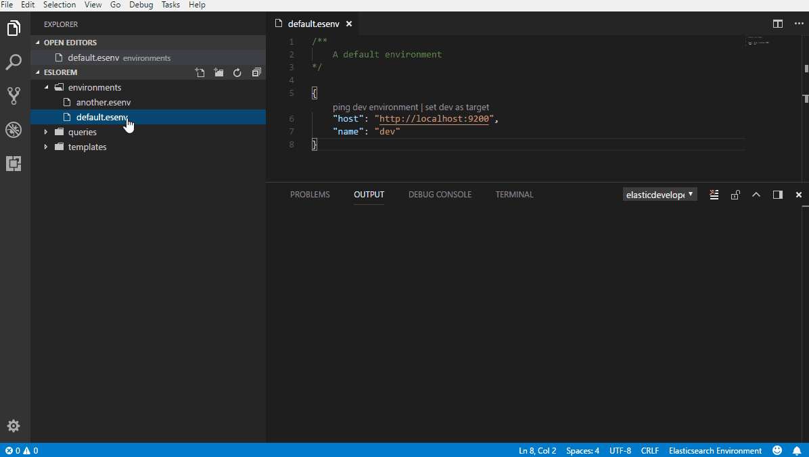
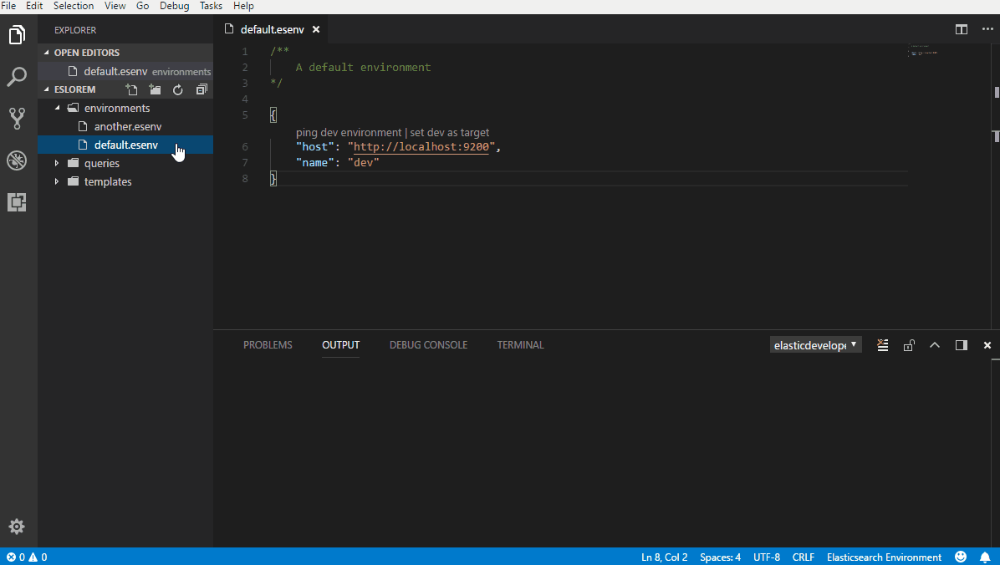
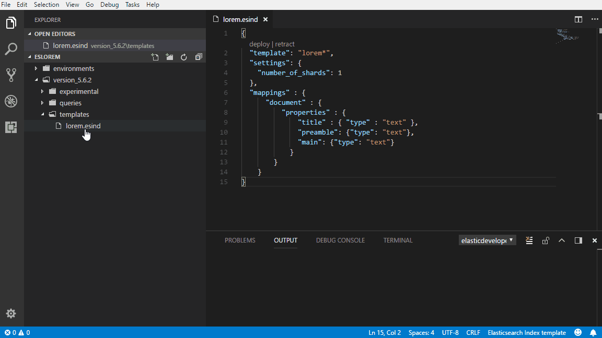
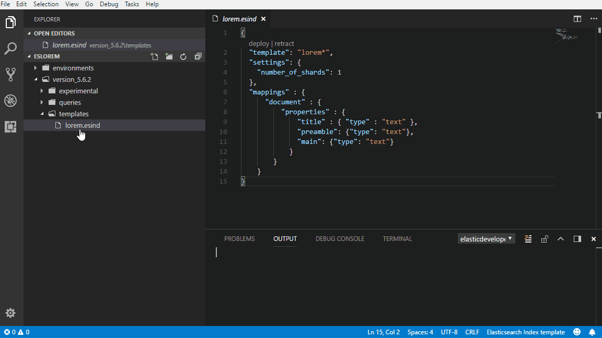
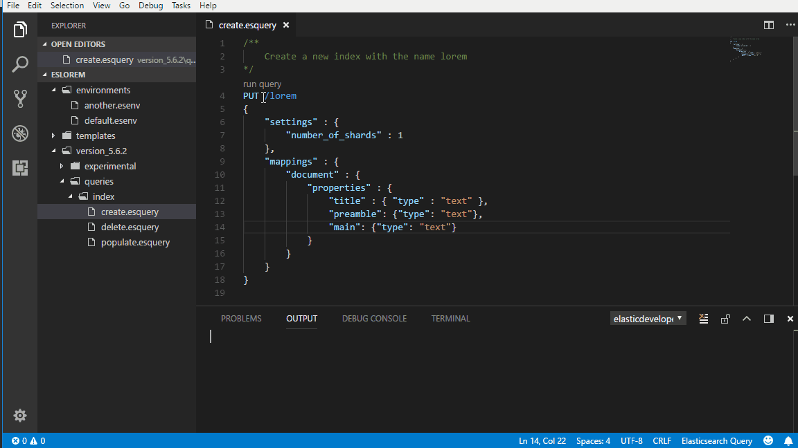
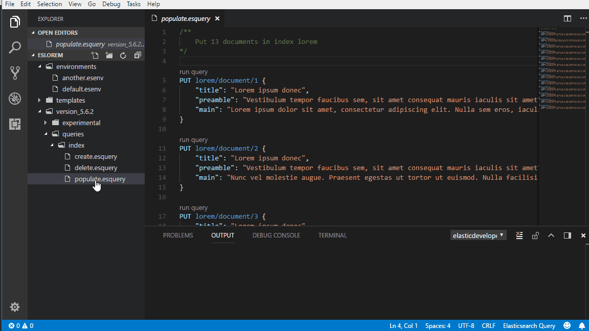
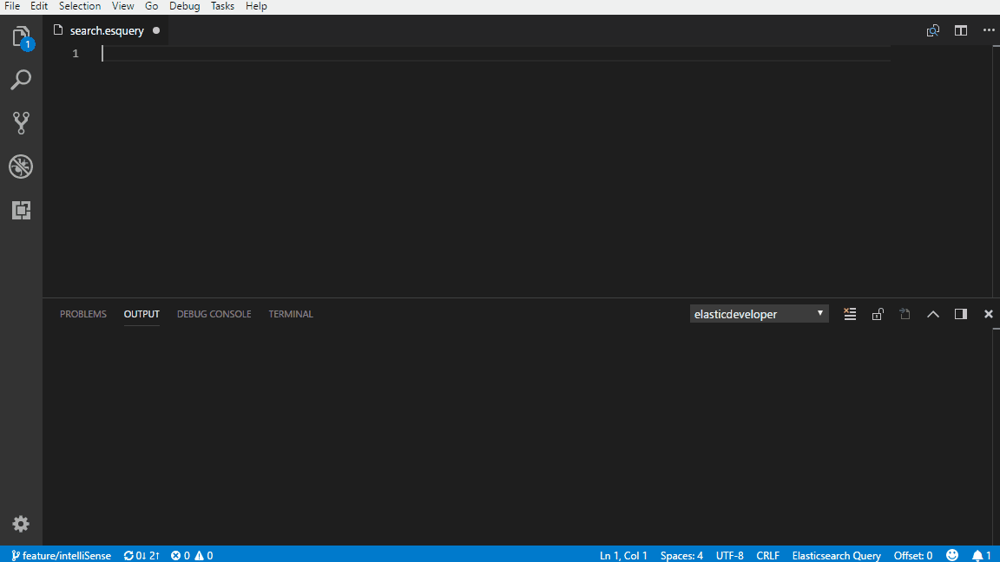
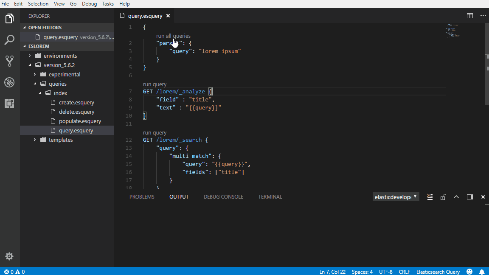
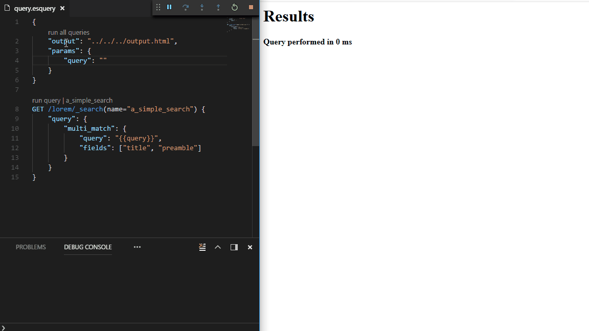

# Elastic Developer

This is a vscode extension that I have built to make it easier to work with Elastichsearch queries. This is also my first vscode extension and I took the opportunity to refresh my memory with some typescript. There is probably some undocumented "features".

## Features
- Environment
    - Mutiple environments
    - Ping an environment
    - Change target environment
- Index template
    - Deploy an index template to the target environment
    - Retract the index template from the target environment
- Query
    - Autocomplete for Elasticsearch HTTP API
    - Run a single query
        - Support for Bulk API, Multi Search API
    - Run multiple queries
    - Manage the same input in multiple queries
    - Save output as JSON
    - Save and transform response to HTML
    - Save multiple response as both JSON and HTML at the same time

### Demo
Checkout the demo project https://github.com/Crasnam/vscode-elasticdeveloper/tree/master/demo/eslorem for examples.

## Description
### Environment
This is an Elasticsearch server and should be created in a file with extension *esenv*, see below for an example. It is possible to have multiple environments in a workspace but these must be separate files.

```json
    {
        "host": "http://localhost:9200",
        "name": "dev"
    }
```

#### Ping
This action will check that the environment is reachable.



#### Set as target
This action will set the selected environment as target and preceding queries will use this environment.



### Index template
Index template can be created in files with extension *esind*. The deployed index template will use the filename as name.

```
{
  "template": "lorem*",
  "settings": {
    "number_of_shards": 1
  },
  "mappings" : {
      "document" : {
          "properties" : {
              "title" : { "type" : "text" },
              "preamble": {"type": "text"},
              "main": {"type": "text"}
            }
        }
    }
}
```

> Read more about index templates in the Elasticsearch docs,
https://www.elastic.co/guide/en/elasticsearch/reference/current/indices-templates.html

#### Deploy
This action will deploy the index template to the target environment.



#### Retract
This action will delete the index template from the target environment, this will not delete any existing indices created from the index template.



### Query
Queries can be created in a file with the extension *esquery* and a file can contain more than one query. 

```json
    GET /lorem/_search
    {
        "query": {
            "match_all": { }
        }
    }
```

#### Run Query
This code lens action will run the active query.



#### Run all queries
This action will run all queries in a selected esquery file.



#### Run Bulk
The extension has support for the Bulk API and will manage the conversion of multiple bodies to the NDJSON format, see the file populate_bulk.esquery in the demo project for an example.

#### Autocomplete for Elasticsearch HTTP API


> This is only a basic support for autocompletion. The feature does not support query strings at the moment.

### Named query 
A named query give you the possiblity to easier identify queries when using the "Run all queries" action and using HTML transformations. The name should be JSON firendly because the name will be added as a property on the response object.

> This is not the same as https://www.elastic.co/guide/en/elasticsearch/reference/current/search-request-named-queries-and-filters.html

```
    GET /lorem/_search (name="a_simple_search")
    {
        "query": {
            "match_all": { }
        }
    }
```

### Configure
By defining a configuration object in an *esquery* file it is possible to manage the input to all queries in the current file. This is useful when you want to test a search and also see how different analyzers analyze the same input.

> This is a simple "search-and-replace" function and not some advanced logic. I recommend to always use " around the variable, even if the value is a numeric.

```json
    {
        "params": {
            "size": 15,
            "query": "lorem ipsum donec"
        }
    }

    GET /lorem/_analyze {
        "field" : "title",
        "text" : "{{query}}"
    }

    GET /lorem/_search {
        "size": "{{size}}",
        "query": {
            "multi_match": {
                "query": "{{query}}",
                "fields": ["title"]
            }
        }
    }
```
> The extension is using the same syntax as Mustache for identifying sections to replace, so this will cause some trouble when using Search templates, see https://www.elastic.co/guide/en/elasticsearch/reference/current/search-template.html.

### Run all queries
When using a configuration object this object will get a "Run all queries".



### Output
By default elasticdeveloper extension will always create a temp file for the response. With the help of a configuration object it is possible to create a fixed output. The example below will save the response from Elasticsearch in the file *query.json* with the same path as the *esquery* file.

> When using a fixed output the extension will not automatically open the response.

```json
    {
        "output": "./query.json",
        "params": {
            "query": "lorem ipsum donec"
        }
    }
```

#### HTML
Beside saving the response in a JSON file the extension can also transform and save the response as a HTML file. This is done with Handlebars http://handlebarsjs.com/. This will give you a more visual and readable overview of the response, this depends on your "HTML/css/design skills" ;) 

For this to work you need to create your own HTML template file that has the same name and path as the *esquery file*. 

In the configuration object set the output to an file with HTML file extension. Use a different name on the output so it does not match the HTML template file so you dont overwrite your HTML template. 

> Name your query or queries to make it more easier to use in the HTML template, see "Nameing a query"



##### Example

*./query.esquery*
```json
    {
        "output": "./output.html",
        "params": {
            "query": "lorem ipsum"
        }
    }

    GET /lorem/_search(name="a_simple_search") {
        "query": {
            "multi_match": {
                "query": "{{query}}",
                "fields": ["title"]
            }
        }
    }
```

*./query.html*
```html
    <html>
        <body>
            <h1>Results</h1>
            <h4>Query performed in {{a_simple_search.body.took}} ms</h4>

            {{#each a_simple_search.body.hits.hits}}
                <div>
                    <p>
                        <span><strong>score=</strong>{{_score}}</span>,
                        <span><strong>id=</strong>{{_id}}</span>
                    </p>
                    <p>
                        {{#each _source}}
                            <span><strong>{{@key}}=</strong>{{.}}</span>
                        {{/each}}
                    </p>
                </div>
                <hr/>
            {{/each}}

        </body>
    </html>
```

##### Saving response as both HTML and JSON
It is possible to apply HTML transformation and save the JSON file by specifying multiple file extensions.

```json
    {
        "output": "./output.html|json",
        "params": {
            "query": "lorem ipsum"
        }
    }
```

##### Use a web browser
If you use this in combination with a web browser you can have much larger workspace. You will need a debbuger extension for an browser and then you can add a configuration in *.vscode/launch.json* that should launch your browser with the output file.

*Example configuration for "Debugger for FireFox"*

```json
    {
        "type": "firefox",
        "request": "launch",
        "reAttach": true,
        "name": "Launch query.html",
        "file": "${workspaceFolder}/query.html",
        "reloadOnChange": {
            "watch": [ 
                "${workspaceFolder}/*.html"]
        }
    }

```


